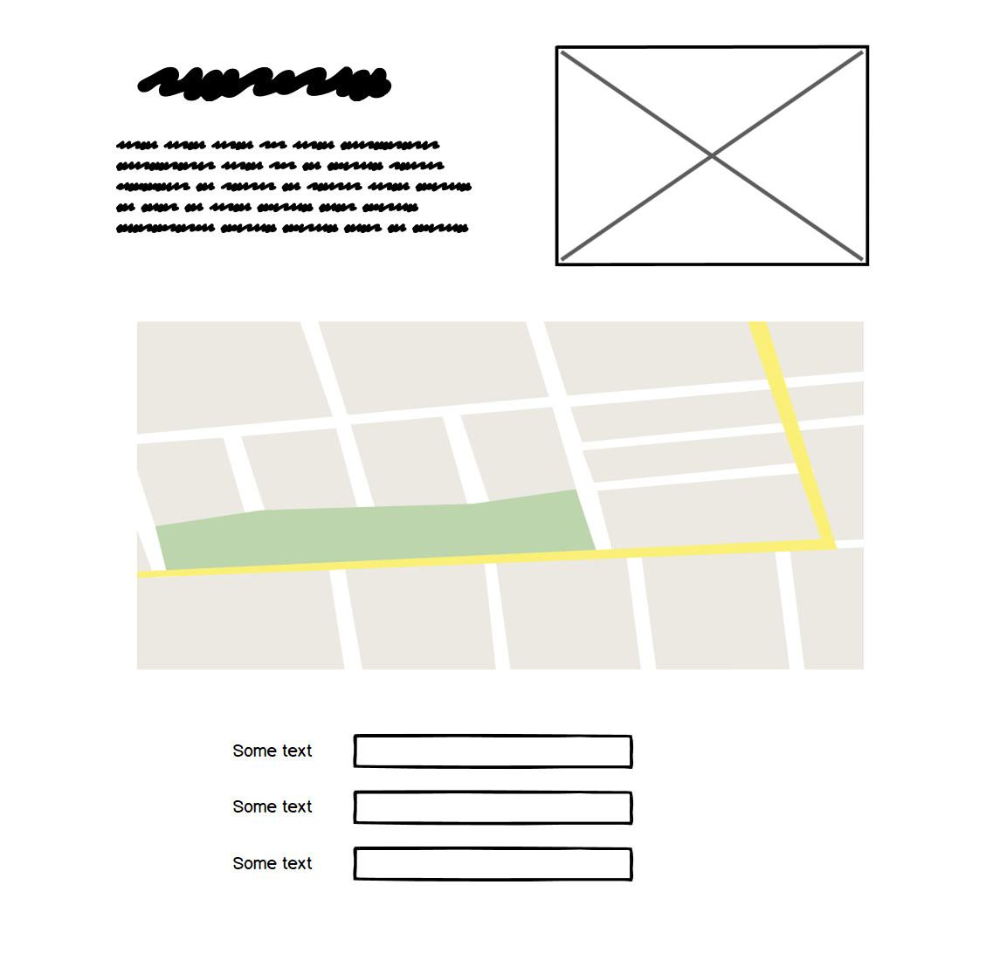

# Information about Taiwan

https://lilychuang78.github.io/minestone2/ 
This website is built to be have basic information about Taiwan using a Google Place API.
The website is responsive on desktop and smaller devices such as pad and smartphone. 
At the moment, the form in "Contact" page is not functional as it is not connected to the backend dataset.
 

## UX
### Scope Plane:
1. what they say they need: a website about Taiwan
2. what they actually need: an interactive website for users
3. what they don't know they need: other possible ways to interact with the website, such as a contact form
### Skeleton Plane:
The skeleton plane was created using Balsamiq Wireframes.

### Strategy Plan:
1. what does the user expect? information, map and photos of Taiwan
2. who are the users? people who wants to visit Taiwan
3. does it offer what users want? users are able to click on the map and see further photos
### Structure Plane:
The website has one page which is divided with three sections: brief information, Google Place API and a contact form
## Development Tools:
Balsamiq Wireframes 
Bracket 
Bootstrap 
Bootsnip 
Coolors 
CSS3 
Emailjs 
Freeformater.com 
Github 
Gitpod 
Google API 
Google Chrome developer tools 
HTML5 
Unsplash 

## Future Development
potentially the website can be linked with other relavant touristic websites

## Testing
The functionality and visiual display of the website were tested with Github locally and Google Chrome developer tools. 
Both desktop responsive view and smartphone view including Moto G4, Galaxy S5, Pixel2, Pixel2 XL, iPhone5/SE, iPhone6/7/8, iPhone6/7/8 Plus, iPhoneX, iPad, iPad Pro, Surface Duo, and Galaxy Fold were examined. 
The code was reformatted and checked using Freeformater.com's formatter and validator.
## Deployment
Website was coded using Gitpod and uploaded to Github using git command.
Commands including "git add ." to add the files, "git commit -m 'message'" to stage, and "git push" to deploy on Github. In the settings option, I selected the master branch to publish online.

The repository can be found here: https://lilychuang78.github.io/milestone1/
## Credits
I want to specially thank my mentor Spencer Barriball and the tutors online who helped me constantly.

### Content
README.md was inspired by
- Code Institute readme-template: https://github.com/Code-Institute-Solutions/readme-template
- my mentor's Monkees Project: https://github.com/5pence/monkees-project/blob/master/README.md
### Code
- Bootsrap4 was used and modified throughout the website.
- Javascript was inspired by 
Google API:
https://developers.google.com/maps/documentation/javascript/local-context/samples/basic
Code institute:
https://github.com/Code-Institute-Solutions/InteractiveFrontendDevelopment-Resume/tree/master/03-SendingEmailsUsingEmailJS/06-sending_emails
### Media
- The hero image was downloaded from Unsplash: 
https://unsplash.com/photos/au3CYbd7vCU
